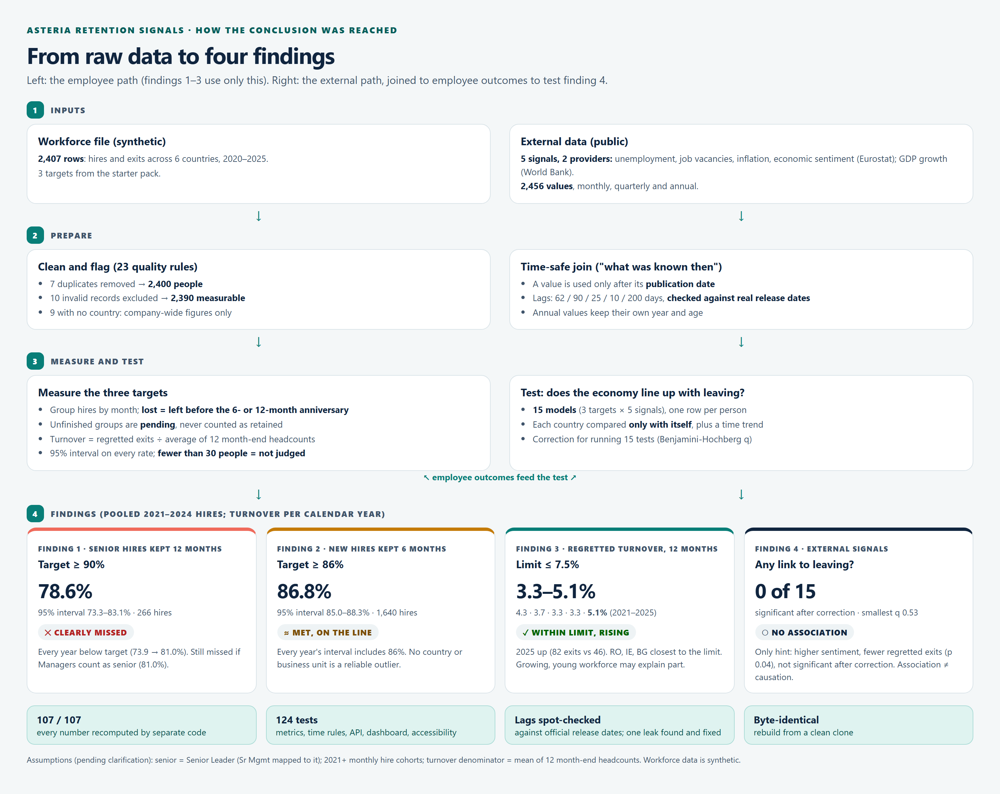

# Dashboard guide: reading it and presenting the findings

Start the dashboard with `uv run asteria serve` and open [http://127.0.0.1:8000](http://127.0.0.1:8000). Each view below can be shared as a link: the filters are stored in the address bar.

---

## 1. What the dashboard answers

Two questions, from top to bottom:

1. **Is Asteria hitting its three retention targets?** (Key findings, Objective status, Trends)
2. **Does the outside economy line up with people leaving?** (Trends right-hand chart, Relationships)

**Key findings** answers both at a glance; **Objective status**, **Trends** and **Relationships** let you check and challenge each one; **Data trust** shows why the numbers can be trusted. The brief calls these views Explore, Understand, Challenge and Trust.

## 2. Key findings panel

Four cards, one per finding, **computed live from the data** (API `/api/findings`), so they always match [findings.md](findings.md).

- **Headline numbers** pool every *complete* hire year, 2021–2024. 2025 hires can't be judged yet: no 2025 senior hire has reached 12 months, and only January–June hires have reached 6 months.
- **The verdict** uses the same rule as the status cards. *Clearly missed/met* means the whole 95% interval is on one side of the target; *on the line* means it includes the target.
- **"Show me"** sets the filters for that finding (All countries, All units, Year) and jumps to the chart that shows it. Finding 4 opens the Relationships panel on the strongest signal.

## 3. The filters (top bar)

Every filter changes everything below it.

| Filter              | What it does                                                                                                                                                                    |
| ------------------- | ------------------------------------------------------------------------------------------------------------------------------------------------------------------------------- |
| **Objective**       | Which target the charts and the Relationships panel show. The three Status cards always show all three targets.                                                                   |
| **Country**         | All countries, or one. "All countries" also includes the 9 people with no country.                                                                                              |
| **Business unit**   | All, or one unit (Digital, Finance, Sales, Supply Chain)                                                                                                                        |
| **Period**          | How hires are grouped: by year, quarter or month. For turnover, the 12-month window ending at that period.                                                                      |
| **Definition**      | *Main* = our assumptions. *Senior + Manager* (senior target only) counts Managers as senior. *Unknown regrets counted* (turnover only) counts the 2 unclear exits as regretted. |
| **External signal** | Which economic indicator the right-hand chart and the scatter show                                                                                                              |

## 4. Why you see "Too few people"

**This is deliberate.** A rate is only judged when a group has **at least 30 people**. Below that, one person leaving moves the rate by more than 3 points, so "met" or "not met" would be guesswork. The dashboard still shows the number, but it:

- sets the badge to **? Too few people** and greys the number
- says how many people there are and what to change, e.g. *"Not judged: only 3 senior hires in this slice, and 30 are needed. Try Business unit: All."*
- draws the point **hollow** on the trend chart

Filtering quickly makes groups small, because the workforce is small:

| Slice                                             | People per slice  | Result             |
| ------------------------------------------------- | ----------------- | ------------------ |
| New hires, all countries, one year                | 393–433           | Always judged      |
| New hires, one country, one year                  | 53–93             | Judged             |
| New hires, one business unit, one year            | 87–121            | Judged             |
| New hires, one country **and** one unit, one year | 8–34 (average 17) | Mostly too few     |
| New hires, one country, one **quarter**           | 7–29              | Too few            |
| **Senior** hires, all countries, one year         | 63–71             | Judged             |
| **Senior** hires, one country, one year           | **5–19**          | **Always too few** |

**Rule of thumb for the presentation:**

- **Senior target:** keep Country = All countries and Period = Year.
- **New-hire target:** fine by country or by unit, but not both at once, and use Year.
- **Turnover:** works almost everywhere, because it counts the whole workforce (hundreds of people), not just one year's hires.

The other messages you may see:

| Message                                       | Meaning                                                                                                                                                               |
| --------------------------------------------- | --------------------------------------------------------------------------------------------------------------------------------------------------------------------- |
| **… Pending**                                 | The group's 6- or 12-month window hasn't finished by 31 Dec 2025. For example, 2025 hires can't yet be judged on 12-month retention. We never count them as "stayed". |
| **No measured period for this selection yet** | Every period in the slice is pending or empty                                                                                                                         |
| **No hires in this slice**                    | Nobody matching the filters was hired                                                                                                                                 |

## 5. Reading each section

### Objective status: one card per target

Using the senior card as an example:

| Line on the card                                                | Meaning                                                      |
| --------------------------------------------------------------- | ------------------------------------------------------------ |
| "2024 hires · All countries"                                    | The latest period that can be judged. 2025 is still pending. |
| **81.0%**                                                       | Share of 2024 senior hires still employed 12 months later    |
| Target ≥ 90.0%                                                  | From the starter objectives file                             |
| ✕ NOT MET                                                       | Verdict. The icon and word carry it, not just the colour.    |
| "Clear: the 95% interval is entirely on one side of the target" | Even allowing for chance, it's below 90%                     |
| "Too close to call: the 95% interval includes the target"       | Met or not met, but chance could flip it                     |
| "95% interval 69.6% – 88.8% · 63 hires"                         | The plausible range, and how many people it's based on       |
| "1 later period(s) pending"                                     | Newer periods exist but can't be judged yet                  |

### Trends (the brief's "Understand"): two charts side by side

**Left, the target over time:**

- **Line:** the rate per period.
- **Shaded band:** the 95% interval. A narrow band means many people; a wide band means few.
- **Horizontal line:** the target. If the whole band is below it, the target is clearly missed. If the band crosses it, it's too close to call.
- **Hollow dots:** fewer than 30 people, so not judged.

**Right, the economic signal as it was known each month:**

- **Step line:** the signal *as published by that month*. It steps because a value stays until the next one is published. Annual GDP, for example, stays flat for a year.
- **Why two charts, not one:** the units differ (percent retained vs percent unemployed). One chart with two scales would suggest a link just by how the axes line up.

### Relationships (the brief's "Challenge"): is there a link?

**Left, scatter:** one dot per country and quarter.

- **Across:** the signal value at the time.
- **Up:** the share who left.
- **Dot size:** how many people are in that dot.

If the economy mattered, the dots would form a slope. Small dots at 0% or 100% are quarters with only a few people.

**Right, the test table:** one row per signal.

| Column            | Meaning                                                                                                                                             |
| ----------------- | --------------------------------------------------------------------------------------------------------------------------------------------------- |
| Naive OR          | Odds ratio when mixing all countries together. 1.00 = no link; above 1 = more leaving when the signal is higher; below 1 = less.                    |
| Within country OR | The same, but each country is compared only with itself, over time. **This is the one we trust**, because it removes differences between countries. |
| q                 | Chance-of-fluke score after correcting for running 15 tests. Below 0.05 would count as a finding.                                                   |
| Verdict           | Plain-language reading of the above                                                                                                                 |

The shaded box underneath states the overall conclusion for the selected target.

### Data trust

| Card                   | What to point at                                                                                                                                           |
| ---------------------- | ---------------------------------------------------------------------------------------------------------------------------------------------------------- |
| Freshness and coverage | Every signal covers all 6 countries from 2019. One gap: Italy, April 2020. Provider flags include Italy's vacancy data, which uses a different definition. |
| Workforce data quality | Every correction and exclusion, with row counts. Nothing is dropped silently.                                                                              |
| Definitions and method | Exactly how each number is computed                                                                                                                        |
| Sources and licences   | Eurostat and World Bank, both CC BY 4.0                                                                                                                    |

## 6. Where each finding appears in the dashboard

The Key findings panel shows the pooled numbers; each **Show me** button applies the settings below. The charts show each year separately; both come from the same counts, so the yearly values add up to the pooled one.

| Finding                                              | Set the filters to                                                          | What to show                                                                                                                                                                                                                                   |
| ---------------------------------------------------- | --------------------------------------------------------------------------- | ---------------------------------------------------------------------------------------------------------------------------------------------------------------------------------------------------------------------------------------------- |
| **1. Senior hires clearly miss 90%**                 | Objective **Senior**, Country **All**, Period **Year**, Definition **Main** | Trend: all four years (73.9, 78.9, 80.6, 81.0%) sit below the target line, **and so does the whole band**. Then switch Definition to **Senior + Manager**: still below. That's why the finding doesn't depend on the "who is senior" question. |
| **2. New hires are on the line**                     | Objective **New-hire**, Country **All**, Period **Year**                    | The line hugs 86%, and **the band crosses the target line every year**. Status card: ✓ Met, "Too close to call". Switch Country to RO (lowest) or GR (highest): still too close to call either way.                                            |
| **3. Turnover is within the limit but rose in 2025** | Objective **Regretted turnover**, Country **All**, Period **Year**          | Line well under 7.5% with a clear band; up-tick in 2025 (5.1%). Switch Country to **RO** (6.7%), IE or BG: those bands reach 7.5%, so they're the ones to watch.                                                                               |
| **4. No link to the economy**                        | Any objective; Relationships panel                                            | The box under the table: "No signal is associated…". For the one hint, pick Objective **Regretted turnover** and Signal **Economic sentiment**: OR 0.82, but q 0.53, so not significant. The scatter shows no slope.                           |

## 7. A 4-minute demo script

1. **Key findings (30s).** "Three targets and one question about the economy. Senior retention is clearly missed; new hires are met but on the line; turnover is within its limit; and no economic signal lines up with leaving." Then use **Show me** on each card for steps 2–5.
2. **Senior (60s).** Objective = Senior, Year. "Every year below 90%, and the whole uncertainty band is below it too. If we count Managers as senior, it's still missed, so this doesn't hinge on the open question."
3. **New hires (45s).** "86.8% against 86%. The band crosses the target every year, so we'd call it *on the line*, not *safe*."
4. **Turnover (30s).** "Well under 7.5%, but up in 2025; Romania is closest."
5. **Economy (60s).** Relationships panel. "We tested five signals properly, comparing each country with itself and only using data that had been published. Nothing survives the correction for 15 tests. The honest answer is *no evidence of a link*, with only 57 senior leavers to learn from."
6. **Trust (15s).** "Every exclusion is counted, every source is licensed, and every number is recomputed independently."

